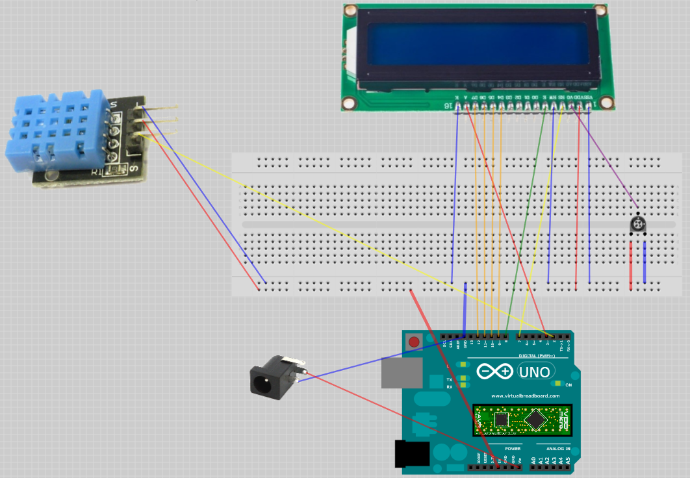

# Arduino Meteo Sensor

Simple Arduino project of a meteo sensor displaying current temperature and humidity values.
The set up is based on Arduino Nano soldered into a breadboard, although it is possible to replace it with Uno and avoid soldring.
The project is based on ELEGOO tutorials: https://www.elegoo.com/pages/arduino-kits-support-files

### Equipment
* Arduino Nano Atmega328P - x1
* LCD 1602 Module - x1
* DHT 11 Temperature and Humidity Module - x1
* Potentiometer (10K) - x1
* Perfboard 7x3cm (24x10 holes + 2x8 side connectors) - x1
* Wires - x19
* 9V/1A DC Power supply (DC-005 male plug) - x1
* DC-005 feemale plug - x1
* Soldering set (iron, solder, flux, e.t.c.) - x1
* USB Cable - x1

⚠️⚠️⚠️ If you use a non-original Arduino Nano based on CH340/CH341 USB chip, you need to dowload drivers from http://www.wch.cn/download/CH341SER_EXE.html, otherwise Arduino studio does not recongnize the board.

### Circuit Diagram

### Tools
* Arduino Studio 1.8.12

### Optional
* Virtual Breadboard 1.5.0 - to open and modify the circuit diagram

### Flash
* Connect the microcontroller via USB
* Open src/arduino-meteo-sensor/arduino-meteo-sensor.ino in Arduino Studio
* Go to Sketch -> Include Library -> Use ZIP Library...
* Select src/DHT.zip and src/LiquidCrystal.zip libraries
* Compile and flash the sketch
